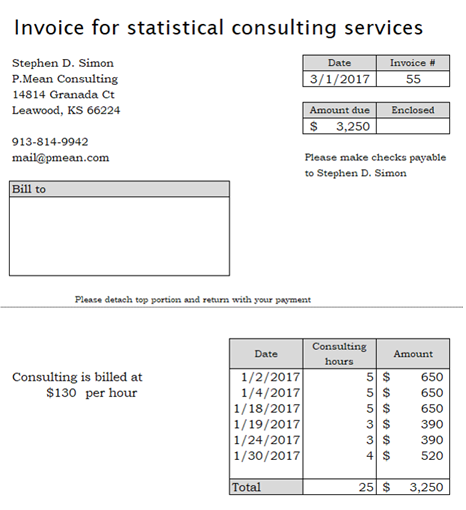

```{r setup, include=FALSE}
# I will not use too much R in this repository, but am 
# including this chunk just in case I need something from R.
knitr::opts_chunk$set(echo = FALSE)
```

## Overview

In this presentation, you will learn to

- Understand the pros and cons of consulting.
- Define the various business entities that you can use for your consulting business.
- Set up a simple process for billing and accounting.
- Discuss common elements in a consulting contract.
- ~~How to find new customers~~

I owe a great debt gratitude for the many interesting questions and  comments posted on the Statistical Consulting Section discussion forum.

<div class="notes">

Here's a brief outline of what I'll talk about today. I will try to keep my comments to 60 minutes of this 90 minute webinar. Ask questions as they occur to you, but I will not answer them until the last 30 minutes.

I will not talk about how to find new customers, as that is a topic important enough to merit its own webinar.

</div>

## A bit about myself


<div class="notes">

I have three jobs! I am a part-time independent consultant with a sole proprietorship, P.Mean Consulting. P. Mean is short for Professor Mean, my alter-ego on the Internet. For those who don't get the joke, I point out the Professor Mean is not just your average professor.

When I started my own consulting business, there were no obvious guides written by statisticians on how to do this, so I started documenting things and presented these at various conferences and on the web. I’ve also gotten a lot of advice along the way from other independent statistical consultants.

I am also a part-time faculty member in the Department of Biomedical and Health Informatics at the University of Missouri-Kansas City. 

I also have a research grant with Enterprise Analytics at Kansas University Medical Center.

If anyone is familiar with the computer term "thrashing", that is a definition of my life now. I am looking for a single full-time benefits eligible job.

</div>

## What color is your consulting parachute?

Take 30 seconds and dream about what your life will be like in five years. If you don't mind sharing your dream with the rest of us, that would be appreciated.

Thinking about your goals five years from now will help you understand the type of consulting business that you want to start and will help you take the first steps in that direction.

<div class="notes">

I have two dreams. I want to be the Principal Investigator for a big NIH grant and I want to write a book on case studies in research ethics using a graphic novel format. I am not an artist, so if anyone listening knows of a good artist who could produce the drawings associated with a good graphic novel, let me know.

</div>

## Two types of consultants.

You are an internal consultant if

- you are part of a larger organization
- you have a "boss".

You are an independent consulant if

- you work alone (or in a small group)
- you are your own boss.

<div class="notes">

If you are an internal consultant, you have someone who supervises you, assigns you work, and (hopefully) helps you grow and develop in your skills.

If you are an independent consultant, you work by yourself (or in a very small group). You find your own work and you supervise yourself.

</div>

## How independent consulting is different

Cons
 
- No support network
- No subsidization for professional development
- Highly variable workload

Pros

- You are your own boss.

<div class="notes">

Here are some of the ways that independent consulting is different.

</div>

## How independent consulting is different

Cons
 
- <div class="red">No support network</div>
- No subsidization for professional development
- Highly variable workload

Pros

- You are your own boss.

<div class="notes">

If you're on your own, you miss out on a lot of support, such as a Human Resources department. You can't pop your head over the cubicle wall and ask a question. No one will decorate your cubicle balloons on your birthday or bring in delicious food on pot luck Friday. 

</div>

## How independent consulting is different

Cons
 
- No support network
- <div class="red">No subsidization for professional development</div>
- Highly variable workload

Pros

- You are your own boss.

<div class="notes">

I have not yet found a client who will pay me to go to the Joint Statistical Meetings. 

</div>

## How independent consulting is different

Cons
 
- No support network
- No subsidization for professional development
- <div class="red">Highly variable workload</div>

Pros

- You are your own boss.

<div class="notes">

In a large organization, there is at least some attempt to spread the workload evenly among you and others. In consulting, it is either feast or famine. You will have long stretches with no work and then all of sudden, you're busier than you can imagine.

</div>

## How independent consulting is different

Cons
 
- No support network
- No subsidization for professional development
- Highly variable workload

Pros

- <div class="red">You are your own boss.</div>

<div class="notes">

On the positive side, you can pick your own hours and your own customers. You can seek out work that you like and avoid work that you dislike.

</div>

## Various business entities.

- Sole proprietorship
- ~~Business partnership~~
- Limited Liability Corporation (LLC)
- S chapter/C chapter corporation

Caution: I am not a lawyer. Also laws about business entities vary greatly from state to state.

<div class="notes">

You can start as a sole proprietorship and convert to an LLC or S/C corporation later. You can also convert an LLC to an S/C corporation.

I am a sole proprietorship, but that choice may not be the right one for you. Talk to a lawyer about these choices.

</div>

## Various business entities.

- <div class="red">Sole proprietorship</div>
- ~~Business partnership~~
- Limited Liability Corporation (LLC)
- S chapter/C chapter corporation

<div class="notes">

In a sole proprietorship, you are doing business under your name.  You do not need to file any paperwork and taxes are relatively simple.  It cannot be a partnership (sole=one and only one). You are personally liable for any debts and cannot protect your personal assets if you get sued.

</div>

## Various business entities.

- Sole proprietorship
- <div class="red">~~Business partnership~~</div>
- Limited Liability Corporation (LLC)
- S chapter/C chapter corporation

<div class="notes">

In a partnership, two or more people share ownership of a business. In a partnership, partners are jointly and individually liable. You must define issues associated with dividing profits and the different responsibilities of each partner. You also need rules on how to add new partners and how to dissolve the partnership.

I do not recommend a business partnership. It's very complicated to set up properly. It would be simpler for you to set up your own business entity and then subcontract some of the work to your "partner".

</div>

## Various business entities.

- Sole proprietorship
- ~~Business partnership~~
- <div class="red">Limited Liability Corporation (LLC)</div>
- S chapter/C chapter corporation

Caution: I am not a lawyer. Also laws about business entities vary greatly from state to state.

<div class="notes">

A limited liability company (LLC) produces an independent legal entity that conducts business under its own name. It provides protection against creditors and litigants (hence the “limited” in the name). It requires some legal paperwork and possibly some legal fees.

</div>

## Various business entities.

- Sole proprietorship
- ~~Business partnership~~
- Limited Liability Corporation (LLC)
- <div class="red">S chapter/C chapter corporation</div>

<div class="notes">

An S corporation/C corporation also produces an independent legal entity that conducts business under its own name. It has some protection against creditors and litigants. It has more stringent legal requirements than an LLC. Like an LLC, it requires paperwork and legal fees. It has special rules for taxation that can sometime save you money. Tax rules are the biggest differentiation between an LLC and an S/C corporation and also the biggest differentiation between an S corporation and a C corporation.

</div>

## Questions to ask about business entities

- <div class="red">Are you taking out a loan to start your inpependent consulting business?</div>

- How likely are you to be sued by your customers? High litigation risk may make you seek out the protections of an LLC or S/C corporation.

- How sensitive are you to tax issues?

- How complicated do you want your legal/accounting life to be? 

<div class="notes">

Here are some questions to ask before deciding on sole proprietorship or LLC or S/C corporation. 

- Large loans may make you seek out the financial protections of an LLC or S/C corporation.

</div>

## Questions to ask about business entities

- Are you taking out a loan to start your independent consulting business?

- <div class="red">How likely are you to be sued by your customers? High litigation risk may make you seek out the protections of an LLC or S/C corporation.</div>

- How sensitive are you to tax issues?

- How complicated do you want your legal/accounting life to be? 

<div class="notes">

- An S/C corporation offers ways to route income through different routes with different tax implications. The S/C corporation might also offer tax advantages to the payment of health benefits to yourself.

</div>

## Questions to ask about business entities

- Are you taking out a loan to start your independent consulting business?

- How likely are you to be sued by your customers? High litigation risk may make you seek out the protections of an LLC or S/C corporation.

- <div class="red">How sensitive are you to tax issues?</div>

- How complicated do you want your legal/accounting life to be?

<div class="notes">

- You may or may not see substantial tax savings with different business models.

</div>

## Questions to ask about business entities

- Are you taking out a loan to start your independent consulting business?

- How likely are you to be sued by your customers? High litigation risk may make you seek out the protections of an LLC or S/C corporation.

- How sensitive are you to tax issues?

- <div class="red">How complicated do you want your legal/accounting life to be?</div>

<div class="notes">

- The sole proprietorship has the fewest complications and the S/C corporation has the most complications.

It’s important to note that the rules on each of these business models vary from state to state! Talk to a lawyer, talk to a lawyer, talk to a lawyer!

</div>

## Accounting -- How to bill

You have two choices

- Bill by the project
- Bill by the hour

The average rate is $130 per hour. See the 2006 issue of the Statistical Consulting Section newsletter (v23.1).

<div class="notes">

If you bill by the project, get a scope of work in writing. If the scope of the project changes ("can I add one little thing?"), then change the 

</div>

## Accounting -- Invoicing



<div class="notes">

You need a way to get paid and most business will ask for an invoice before you get paid. You can find professional style invoices if you invest in accounting software.

You can also produce business-quality invoices with a standard word processing document or spreadsheet. A simple Internet search for “sample invoice template” works well.

</div>

## Accounting -- Invoicing

The invoice should include

- your name and address,
- the name and address of your client,
- the date the invoice was printed,
- a unique invoice number,
- who the check should be made out to (your name or your company’s name).
- your price with itemization details, and
- a due date on the invoice or a rate that would apply if the invoice is paid late.

<div class="notes">

There is no legal requirements for an invoice, so all of these are suggestions.

</div>

## Accounting - separate checking account.

Set up a business checking account.

- Deposit business income here
- Pay business expenses here
- Transfer money as needed to your personal account.

<div class="notes">

The separate account is very important if you want to document business expenses and deduct them from your business income for tax purposes. Do not mix business and personal expenses as it makes it harder for you if your taxes should be audited.

</div>

## Contracts

“A verbal contract isn’t worth the paper it is written on.”
Samuel Goldwyn, found at www.brainyquote.com/quotes/quotes/s/samuelgold122394.html

You can dispense with a contract if you trust the other party to treat you fairly or if you are willing to handle an unresolvable dispute by forgoing your consulting fee.

<div class="notes">

Even if you don’t have a formal contract, you should send an email that outlines your understanding of what you will do and when and what you expect from your client.


</div>

## Contracts

Some elements that this contract could cover include:

- How much and how often you will be paid.
- The scope of work of the project.
- How to handle disputes.
- Issues involving liability (protection against lawsuits involving third parties).
- Assurances about maintaining appropriate confidentiality for any data you receive.

<div class="notes">

A good contract should be symmetrical and not place all of the burden (e.g., penalties, liability risks) on one party.

</div>

## Contracts

Look out for provisions that 

- place all the responsibility in your lap should a third party decide to sue your client.
- limit your ability to seek redress if there is a dispute between you and the client
- place unreasonable demands on you (e.g., carrying an excessive amount of insurance).
- that limit your ability to re-use your own code for other clients.
- that restrict your consulting fee to the lowest amount that you charge anyone else.
- that make your fee contingent on a certain statistical outcome.

## Some good advice on contracts

“I long ago learned the power of "just saying no" in contract negotiations.  The vast majority of stuff I cross out, with only a cursory explanation of why (no need to write paragraphs) is accepted with no objection whatsoever.  I'm not shy about crossing out lots of things, either.  It's often standard boilerplate whose purpose was long forgotten, or stuff some lazy lawyer put in either so they could use the same contract for everything or to avoid having to question the client as to what protections they really needed.  If there's an actual reason for it that applies to your situation, you'll hear about it once you say "no," and can go from there.” David Lyon, Email to the Statistics Consulting Section of the ASA, August 30, 2014.

<div class="notes">

The best advice I heard about contracts was in an email sent to the Consulting Section discussion board. It was so well written that I am quoting it here verbatim.

</div>

## Insurance -- personal insurance

Personal insurance
- Life insurance
- Health insurance
- Disability insurance
- etc.

Business insurance
- Liability insurance
- Errors and Omissions insurance

<div class="notes">

Before you quit your normal job, talk to human resources about options to continue your insurance coverage after you leave work. You can also purchase insurance through some professional organizations, such as the National Association of the Self Employed. You can always find a insurance agent and purchase your own insurance directly from them.

</div>

## Insurance -- business insurance

Business insurance
- <div class="red">Liability insurance</div>
- Errors and Omissions insurance

<div class="notes">

Issues that raise concern about the need for liability insurance are working with a wide range of clients, working on projects with a forseeable possibility that a third party might try to sue your client and you both, working on projects that involve life or death decisions, such as a Data Safety and Monitoring Board.

</div>

## Insurance -- business insurance

Business insurance
- Liability insurance
- <div class="red">Errors and Omissions (E&O) insurance</div>

<div class="notes">

There are other things you could be sued about that might not be covered by most liability insurance packages. Some examples: An error in your data analysis causes a delay in FDA approval of a new drug. The company sues you for lost income; Your automated real-time monitoring software causes a failure in the assembly line. The company sues you for re-tooling costs. These types of problems are covered by E&O insurance.

</div>

## Summary

In this talk, we reviewed the 

- business entities, 
- billing options,
- contacts, and
- insurance options.

The slides for this talk are available at 

- https://github.com/pmean/business-essentials

<div class="notes">

Here's a review of everything I covered. Thank you and let me know if you have any questions.

</div>


